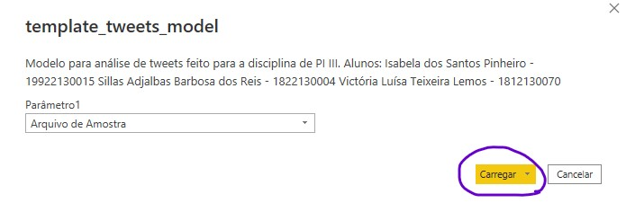
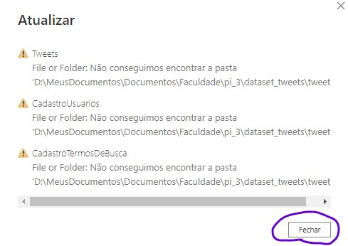
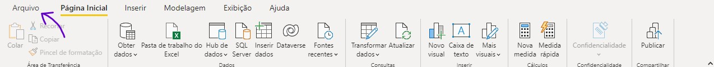
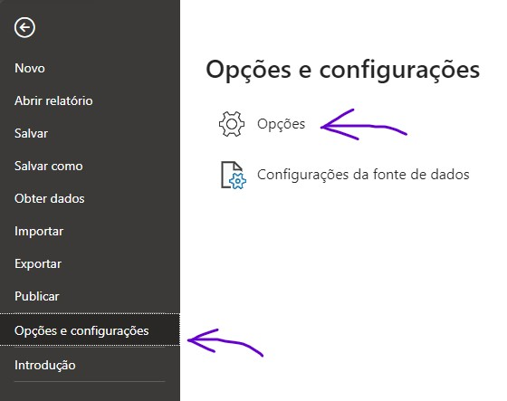
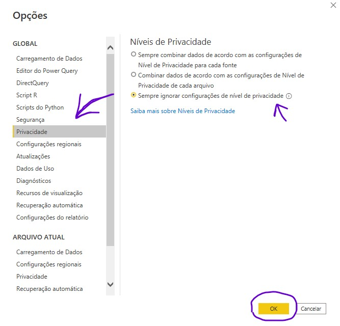
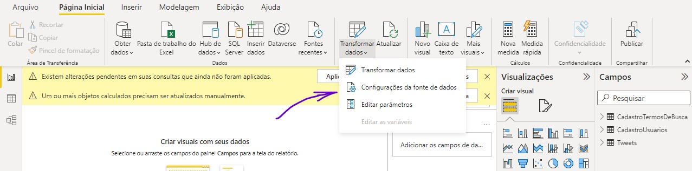
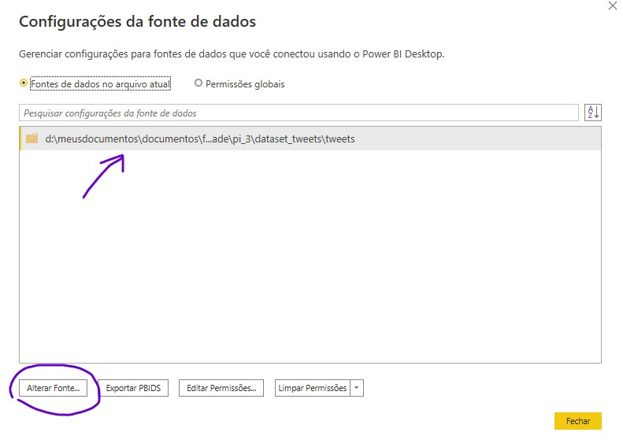
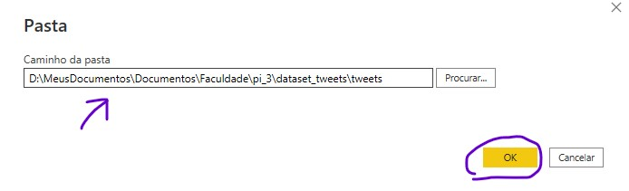
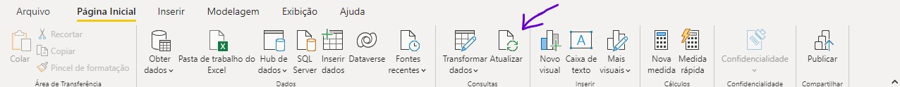

# Projeto Integrador III - Centro Universitário IESB

[TOC]

## 📖 Introdução
Projeto acadêmico de Análise de Dados, utilizando Power BI para analisar o comportamento das eleições no Brasil através da rede social Twitter.

## 🐦 Tweet Scrapper
Script desenvolvido para buscar tweets envolvendo os principais candidatos a presidência do Brasil nas eleições de 2022. Para recuperar as postagens, o script usa o projeto [twint](https://github.com/kevctae/twint) e, para realizar alguns ajustes no retorno, utiliza a biblioteca [pandas](https://pandas.pydata.org/docs/).

Para usar o script, instale primeiro as dependências:

```sh
pip install -r tweet_scrapper/requirements.txt
```

Use o seguinte comando para retornar os tweets das últimas horas:

```sh
python ./tweet_scrapper/tweet_scrapper.py <termo de busca> <quantidade de horas> <pasta para gravar a saída>
```

Caso queira criar um cronjob para rodar o script periodicamente a cada hora, a seguinte regra é sugerida:

```sh
0 * * * * python ./tweet_scrapper/tweet_scrapper.py <termo de busca> 1 <pasta para gravar a saída> >>  <pasta para gravar os logs>/<termo de busca>.log 2>&1
```

## 📈 Template Power BI
Com o [Power BI](https://powerbi.microsoft.com/pt-br/desktop/) instalado, faça o que se pede:

1. Ao abrir o arquivo [template_tweets_model.pbit](./template_tweets_model.pbit) com o Power BI, clique em carregar na tela que será apresentada.



2. Após ser carregado, o modelo apresentará um erro indicando a inexistência da fonte de dados. Clique em fechar e siga os próximos passos para resolver o problema.



3. Clique na opção "Arquivo" no menu superior e navegue até as configurações em "Opções e configurações -> Opções".





4. Vá até a aba "Privacidade" nas opções globais, mude para a opção "Sempre ignorar configuração de nível de privacidade" e clique em "OK".



5. Novamente na página inicial, procure pela opção "Transformar dados" e selecione "Configuração da fonte de dados".



6. Na nova tela, clique na opção "Alterar Fonte...".



7. Selecione o diretório em que se encontram seus arquivos .csv gerados pelo [tweet_scrapper.py](./tweet_scrapper/tweet_scrapper.py) e clique em "OK".



8. Por último, clique na opção "Atualizar" para refletir a alteração na fonte de dados. Os dados serão carregados e transformados e você estara pronto para utilizá-los.



Obs.: O passo 8 pode demorar para ser concluído, dependendo do tamanho da fonte de dados.

## 🗃️ Dataset
Acesse o [link do drive](https://drive.google.com/drive/folders/1FGMvr1yfnIG7gRTS1tCUjuaZGJ_swycU?usp=sharing) para baixar arquivos .csv com tweets sobre os 3 principais concorrentes a presidência nas eleições de 2022.

<br>

## 👩🧔‍♂️👩 Desenvolvedores:
<p align="justify"> :octocat: <a href="https://github.com/IsabelaPinheiro"> Isabela Pinheiro - 1922130015 </a> </p>
<p align="justify"> :octocat: <a href="https://github.com/SillasReis"> Sillas Reis - 1822130004 </a> </p>
<p align="justify"> :octocat: <a href="https://github.com/lemosvictoria"> Victória Lemos - 1812130070 </a> </p>
